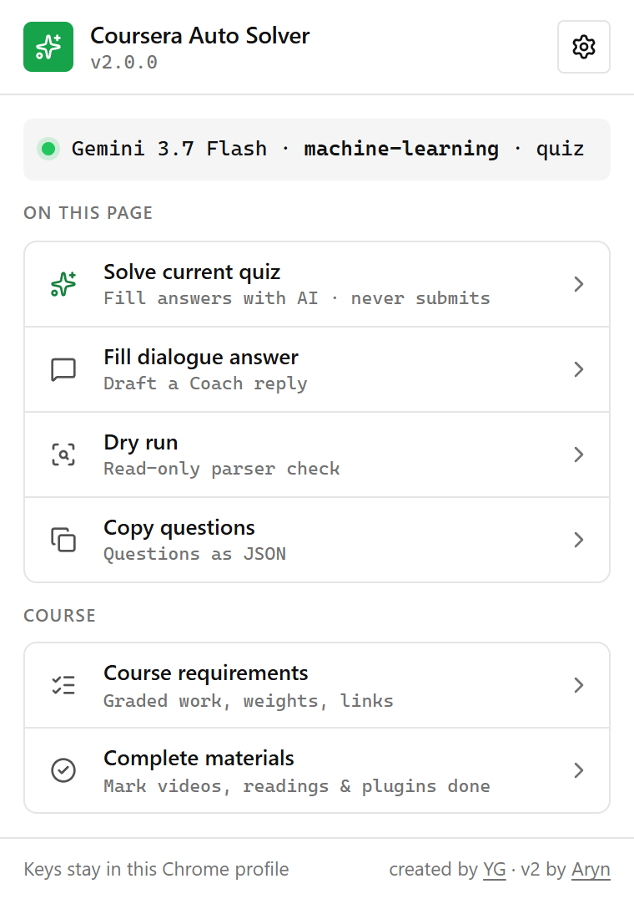

> [!CAUTION]
> ### ⚠️ Disclaimer: For Educational Purposes Only
> This extension was created strictly for **educational and learning purposes** to explore browser extension development, DOM manipulation, and API interception. 
> 
> * **No Liability:** The creator of this extension is not responsible for any consequences that may arise from using this tool.
> * **Academic Integrity:** Coursera has strict policies regarding academic integrity. Using this tool to automatically complete courses or solve quizzes may violate Coursera's Terms of Service and Honor Code.
> By using this open-source software, you agree that you are taking full responsibility for your own actions.

# Coursera Auto Solver 🎓

<div align="center">
  
  <p><em>Speedrun your courses smoothly</em></p>
</div>



🎬 **[Watch the Demo on YouTube](https://www.youtube.com/watch?v=a060UX8dlHE)**

A sleek, lightweight Chrome Extension to automate and help you navigate your Coursera courses with ease. Version 2 is a TypeScript + React rewrite built with [WXT](https://wxt.dev).

The extension never submits anything for you. Quiz answers are filled in for you to review and submit yourself, and dialogue replies are placed in the message box without being sent.

## ✨ Features

* **⚡ Media Auto-Completer:** Marks every video and reading in the course as complete in the background, with live progress in a card on the Coursera page. Locked items are skipped, and quizzes, exams, and other graded work are never touched. No API key required!
* **📋 Question Extractor:** Extracts the quiz and assignment questions on the page as clean JSON, ready to copy. No API key needed!
* **🎯 Course Requirements:** Finds Coursera activities that count toward the course grade, groups them by module, and opens them directly from the popup.
* **🤖 Multi-Provider Quiz Solver:** Fills in multiple-choice, text-input, essay, and Monaco code-expression questions with Gemini, OpenAI, Claude, xAI, DeepSeek, Groq, OpenRouter, or your own [vLLM](https://docs.vllm.ai) server. It never submits: you review the answers, then submit yourself.
* **💬 Dialogue Answer Drafting:** Reads the current Coursera Coach question and fills a suggested answer into the message box for you to review and send.
* **🧪 Dry Run:** Shows how the extension reads the current assessment (selector strategy, question types, and parser issues) as a copyable report. It does not call an AI provider or change anything on the page.
* **🎛️ Model Choice:** Pick from curated current models—including multiple Gemini, GPT, and Claude generations—or enter a custom model ID. For vLLM, pick from the models your server lists.
* **🔐 Session-Aware Request Interception:** Passively observes Coursera's native Fetch and XMLHttpRequest traffic while minimizing the session metadata exposed across the extension boundary.

## 🚀 How to Use

### 1. Install from Source
You need [Bun](https://bun.sh) 1.4 and Node.js 24 to build it, and Chrome 119 or newer to run it.

1. Clone or download this repository to your local machine.
2. Install the dependencies with `bun install`.
3. Build the extension with `bun run build`.
4. Open Google Chrome and navigate to `chrome://extensions/`.
5. Enable **Developer mode** (toggle in the top right corner).
6. Click **Load unpacked** and select the `.output/chrome-mv3` folder.

### 2. Configure and Run
1. Click the **Coursera Auto Solver** icon in your Chrome toolbar. While the active provider is not set up, the popup opens on the **AI provider** settings.
2. Choose a provider and model, paste your API key, and click **Save & verify**. The selected provider becomes active only after a successful check.
   * For **vLLM**, enter the server URL (for example `http://localhost:8000/v1`; a bare `http://host:port` gets `/v1` added) and the API key if the server was started with `--api-key`. Click the refresh button next to **Model** to load the server's models; the first time, Chrome asks to allow access to that server. Then choose a model and click **Save & verify**. If the Chrome prompt closes the popup, open it again: it comes back to the vLLM form with your input, and loads the models once access is allowed.
3. Navigate to any Coursera course page inside the `/learn/` path. The popup's actions are enabled only there.
4. Open a Coursera quiz, choose **Solve current quiz**, and click **Solve quiz**. Progress appears in a card on the Coursera page. Review the filled answers, then submit yourself.
5. On a Coursera Coach dialogue, choose **Fill dialogue answer** and click **Draft reply** to place a draft in the message box. The extension never clicks **Send** for you.
6. Use **Complete materials** to mark videos and readings as complete, **Copy questions** to extract the questions, **Course requirements** to open grade-relevant work, or **Dry run** to check how the page is read.

## 🛠️ Development

* `bun run dev` runs WXT in development mode. It writes a development build to `.output/chrome-mv3-dev` and rebuilds it on every change.
* `bun run check` runs Biome in CI mode; `bun run format` applies Biome's formatting and safe fixes.
* `bun run typecheck` runs the TypeScript compiler without emitting files.
* `bun run zip` packages the production build into a ZIP archive under `.output/`.

## 🧪 Tests

* `bun run test` runs the unit tests with Vitest and happy-dom. They never make network calls.
* `bun run test:invariants` checks the built manifest, the CI workflow, and the test fixtures. Run `bun run build` first.
* `bun run test:e2e` loads the built extension into Playwright's bundled Chromium and runs it against routed Coursera pages. Run `bun run build` first, and install the browser once with `bunx playwright install chromium`.

## 🎯 Course Requirements

The **Course Requirements** feature helps learners find the activities that Coursera marks as relevant to passing a course. Instead of listing every video, reading, and practice item, it builds a focused view of graded or passable work and lets the user navigate directly to supported activities from the popup.

### What it does

When **Course requirements** is opened, the extension:

* Loads Coursera's current course-material structure for the active `/learn/` course, reusing the materials the page already requested when it can.
* Matches passable elements and assignment groups to their underlying course items.
* Organizes the results by module and keeps the original course order.
* Shows the activity name, lesson, and estimated time when available.
* Marks activities that Coursera explicitly identifies as **Required**.
* Shows relative grading-weight percentages when the returned weight data is complete enough to calculate them safely.
* Explains grouped choices such as **Pass 1 choice** when Coursera allows the learner to satisfy a requirement using one or more alternatives.
* Marks locked activities with a lock icon and shows Coursera's lock reason on hover when provided.
* Builds direct links for supported quizzes, exams, assignments, peer reviews, and programming activities, and opens them in the current tab.
* Marks an item as **Link unavailable** instead of inventing a route when its type cannot be mapped safely.

### How requirements are detected

The feature prefers Coursera's explicit passing metadata:

* `onDemandCourseMaterialPassableLessonElements.v1` identifies individual passable items, grading weights, and whether an item is required for passing.
* `onDemandCourseMaterialPassableItemGroups.v1` and `onDemandCourseMaterialPassableItemGroupChoices.v1` describe requirements where the learner can pass a certain number of activities from a group.
* Course modules, lessons, and material items provide names, ordering, types, lock information, time estimates, and navigation data.

When explicit passable metadata is available, the popup marks the result **Confirmed**. If a course does not expose that metadata, the extension falls back to detecting common graded types such as quizzes, exams, staff-graded assignments, graded programming work, and peer reviews. Fallback results receive a **Detected** badge because their passing status could not be confirmed directly.

### What it does not do

Course Requirements is a navigation and course-structure feature. It does not:

* Read the learner's completion status or determine which requirements are already finished.
* Read the learner's current grade.
* Calculate the course's final passing threshold.
* Guarantee that completing every displayed item will pass the course.
* Include ordinary videos, readings, optional practice, or ungraded material unless Coursera explicitly references an item as part of a passable requirement.

Coursera can return incomplete or course-specific metadata. When an item cannot be resolved or linked confidently, the popup reports that limitation rather than presenting it as confirmed information.

## 🔐 Coursera Request Interception

Coursera protects state-changing API requests with session cookies and anti-CSRF headers. Those values can change during a session, so the extension observes the request context already used by Coursera rather than hardcoding it. The interceptor minimizes what crosses from the page's MAIN world into the isolated extension world.

### How it works

A MAIN-world content script is injected at `document_start`, before Coursera's own code runs. It wraps `window.fetch` and the `XMLHttpRequest` methods `open`, `setRequestHeader`, and `send`, and applies a restrictive forwarding policy:

* **Coursera API only:** non-Coursera traffic and non-`/api/` URLs are ignored.
* **Query minimization:** forwarded URLs keep only `slug` and `userId`; unrelated query parameters are discarded.
* **No request bodies:** Fetch/XHR request bodies are never read or forwarded.
* **Header-name diagnostics:** observed allowlisted CSRF/request headers are represented by names only.
* **Single retained header value:** only `x-csrf3-token` may cross with its value because the media-completion requests require it. Authorization, Cookie, CSRF2, framework-CSRF, and `x-requested-with` values are not forwarded.
* **Response minimization:** dispatcher data is reduced to the learner identifier, while course-material responses are reduced to the module/lesson/item/passable fields consumed by Course Requirements.
* **Passive hooks:** the wrapped `fetch` returns Coursera's original response as soon as it arrives and reads a copy afterwards, and each XHR `send` adds exactly one `load` listener.
* **Same-origin messaging:** the page and content-script bridges accept messages only from the same window and the current Coursera origin, and post only to that exact origin.
* **Nothing lost at startup:** the MAIN world keeps a snapshot of the latest token, learner identifier, header names, and course materials. The isolated content script loads later, asks for that snapshot once, and so still receives what was captured before it started.

The original browser networking methods are still called, so interception observes the request without preventing or replacing Coursera's normal network operation.

### Captured request context

The isolated content script keeps the current `x-csrf3-token` value and the learner identifier only in the Coursera tab's memory, because the media-completion requests depend on them. Only **Complete materials** reads them. Other observed allowlisted request headers are represented by their names, not their values.

The retained CSRF3 value is not written to `chrome.storage`, committed to the repository, or included in Dry Run reports. Reloading or closing the Coursera tab clears it.

### Request flow

```text
Coursera creates a Fetch or XHR API request
        ↓
The MAIN-world script (src/main-world/interceptor.ts) observes the request
        ↓
URL/query data, header exposure, and response fields are minimized (src/main-world/intercept-policy.ts)
        ↓
No request body crosses the bridge; only the CSRF3 value may cross
        ↓
The isolated content script keeps session credentials for completion and course-scoped state for reads
```

### Activating interceptor updates

Because the interceptor is injected into Coursera's page context when the page loads, code updates require both steps:

1. Rebuild the extension, open `chrome://extensions/`, and reload the unpacked extension.
2. Refresh the open Coursera course tab so the updated scripts are injected.

If the extension says that authentication data is missing, keep the extension enabled, refresh the course page, and interact with Coursera normally so the page can make a fresh authenticated API request.

## 🤖 Supported AI Providers

| Provider | Get an API key |
| --- | --- |
| Google Gemini | [Google AI Studio](https://aistudio.google.com/app/apikey) |
| OpenAI | [OpenAI API keys](https://platform.openai.com/api-keys) |
| Anthropic Claude | [Claude Console](https://console.anthropic.com/settings/keys) |
| xAI | [xAI Console](https://console.x.ai/) |
| DeepSeek | [DeepSeek Platform](https://platform.deepseek.com/api_keys) |
| Groq | [GroqCloud Console](https://console.groq.com/keys) |
| OpenRouter | [OpenRouter Keys](https://openrouter.ai/settings/keys) |
| vLLM (self-hosted) | The key your server was started with (`vllm serve --api-key …`), or none |

## 🔒 Privacy

* API keys are stored in plain text in `chrome.storage.local` in your Chrome profile. The extension does not encrypt them.
* Keys are sent only to the provider you select. API usage, billing, quotas, and model access are controlled by your provider account. For vLLM, your key and the quiz content go to the server URL you enter; use `https://` for a server outside your own machine or network.
* **Save & verify** checks Gemini, OpenAI, Claude, xAI, and Groq keys with a model-metadata request that generates no text. For DeepSeek and OpenRouter, verification sends a real, billed completion request (capped at 8 output tokens). For vLLM, it checks that the server lists the chosen model.
* The extension requests only the `storage` permission. Its host access is limited to Coursera and the seven hosted provider APIs. For vLLM, Chrome asks for access to your server's origin alone, the first time you load its models.

## 🧩 Architecture

See [docs/ARCHITECTURE.md](docs/ARCHITECTURE.md) for the runtimes, source layout, message protocols, storage, and known limitations.

***

Created by [YG](https://github.com/Youssef-Ghafir)
