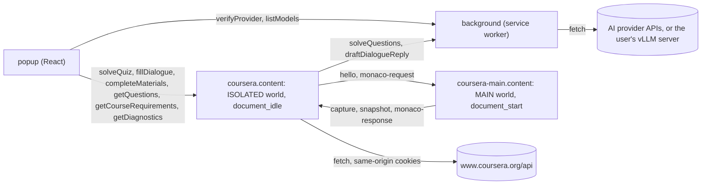

# Extension architecture

Coursera Auto Solver 2 is a Chrome MV3 extension written in TypeScript and React and built with [WXT](https://wxt.dev) 0.21 (`srcDir: "src"`). This document describes how the code is split across the extension's runtimes, how those runtimes talk to each other, and what the extension stores. Behavior that was ported from v1.1.0 cites the old file and line as `<file>:<line> in v1.1.0 (c2f8b71)`; that commit is the reference for the original JavaScript.

## Runtimes



| Runtime | Entrypoint | Role |
| --- | --- | --- |
| Background service worker | `src/entrypoints/background.ts` | Routes `BackgroundRequests` to `createBackgroundHandlers()` (`src/background/handlers.ts`), which call the AI provider through `callProvider`/`requestJSON` (`src/ai/client.ts`) inside `withKeepAlive` (`src/background/keepalive.ts`). Runs `migrateLegacyGeminiKey()` on `onInstalled` and at every service-worker start. |
| ISOLATED content script | `src/entrypoints/coursera.content/index.tsx` | Runs on `*://*.coursera.org/learn/*` at the default `document_idle`. Creates the course state, session credentials, bridge listener, Monaco client, banner and the solve and completion runners, then routes `ContentRequests` to `createContentHandlers()` (`src/content/runtime.ts`). Its `ctx.onInvalidated` callback removes the bridge and message listeners, and WXT unmounts the banner. That invalidation happens only when a newer copy of the content script starts in the same page. Chrome does not re-inject content scripts into open tabs when the extension is reloaded or updated: the old copy stays in the page, orphaned, and its listeners are inert because they no longer receive runtime messages. Reloading the extension and then the page gives the page a fresh copy. |
| MAIN-world content script | `src/entrypoints/coursera-main.content.ts` | Runs on the same URLs with `world: "MAIN"` and `runAt: "document_start"`. Calls `installInterceptor(window)` and `installMonacoHost(window)`. It never uses `browser.*`. |
| Popup | `src/entrypoints/popup/index.html`, `src/entrypoints/popup/main.tsx` | Renders `App` (`src/popup/App.tsx`) inside `BusyProvider` and `StrictMode`. Reads the active tab once, reads and watches provider storage, and talks to the content script with `sendToTab` and to the background with `sendToBackground`. Asks Chrome for access to a vLLM server's origin (`src/popup/lib/server-access.ts`). |

The manifest is generated by WXT from `wxt.config.ts`, `package.json` (version 2.0.0) and the entrypoints. It requests only the `storage` permission; host permissions are Coursera plus the seven hosted provider origins. `optional_host_permissions` is `http://*/*` and `https://*/*`: it adds no install warning and lets the popup ask for the origin of one vLLM server at runtime. The popup `<title>` becomes `action.default_title`. `cssInjectionMode: "ui"` makes WXT emit the banner stylesheet as `content-scripts/coursera.css`, the only web-accessible resource. `minimum_chrome_version` is `"119"`, because the content scripts use `Promise.withResolvers`, which Chrome ships from version 119.

### What each action does

- **Solve current quiz.** `createSolveRunner` (`src/content/solve.ts`) refuses a second run on the same page ("A quiz is already being solved on this page."), replies `{ status: "started" }` and continues in the background. It extracts the assessment, sends the questions to the background as `solveQuestions`, then writes the validated answers with `applyAnswers`. Progress and the result are shown in the banner.
- **Fill dialogue answer.** `fillDialogueAnswer` (`src/content/dialogue-fill.ts`) reads the Coach conversation with `extractDialogueState` (`src/coursera/dialogue.ts`), asks the background for `draftDialogueReply` and fills the React textarea. It never sends the message.
- **Complete materials.** `createCompletionRunner` (`src/content/completion.ts`) takes the course slug from the current route, requires a captured CSRF3 token, loads the course materials, skips locked items and completes videos (`lecture`), readings (`supplement`) and ungraded plugins (`ungradedWidget`) in chunks of 6 with 400 ms between chunks. Before sending anything it reads the learner's progress, `GET onDemandCoursesProgress.v1/{userId}~{courseId}?fields=items`, and leaves out every item whose `progressState` is `Completed` (`completedItemIds`); the banner counts them as already completed, and when nothing is left it reports "Materials already completed" without a single completion request. Progress only saves requests: if it cannot be read (Coursera answers 404 for the `"~"` learner id), every item is requested. Videos and readings take one POST each. A plugin is completed the way its page's **Mark as completed** button does it: `GET onDemandWidgetSessions.v1/{userId}~{courseId}~{itemId}?fields=sessionId` opens a session, then `PUT onDemandWidgetProgress.v1/{userId}~{courseId}~{itemId}` sends `{ sessionId, progressState: "Completed" }`. A plugin whose session request fails or returns no id counts as failed and is never marked. Every item is awaited with `Promise.allSettled`; failures are counted, never fatal. It has its own single-run guard ("Course completion is already running on this page.").
- **Copy questions, Dry run, Course requirements.** Read-only handlers: `getQuestions` returns the extracted questions and parser issues, `getDiagnostics` returns `{ selectors, state }`, and `getCourseRequirements` loads materials and runs `normalizeCourseRequirements` (`src/coursera/requirements.ts`). The Dry Run report itself is built in the popup with `buildDryRunReport` (`src/coursera/diagnostics.ts`).

### Assessment extraction and answer writing

`parseAssessment` (`src/coursera/parser.ts`) selects question blocks (semantic, legacy class-based, or both, de-duplicated and sorted in DOM order) and classifies each one. Question numbers are block index + 1; blocks without a prompt still use up their number and become `missing-prompt` issues. `extractAssessment` (`src/content/extract.ts`) turns the parsed blocks into `Question` objects plus a `QuestionHandle` per question. A handle records the block, its kind (`choice`, `text`, `essay` or `code`) and its parsed `prompt`; a `code` handle also records the Monaco `modelUri` and the `expectedValue` read through the Monaco client. Handles keep no answer nodes: at apply time the writer re-parses the block and writes only through the nodes that parse returns (F2), failing if the prompt or kind changed.

Unsupported blocks are left out of the AI request and reported as `unsupported-question`. Handles never leave the content script.

`applyAnswers` (`src/content/apply-answers.ts`) writes only into the blocks from those handles. React can remount a block's inner nodes during the AI wait, or reuse the block for another question after SPA navigation, so each answer re-parses its block with `parseQuestionBlock` and writes through the nodes rendered now:

- the answer fails with "The question is no longer on the page.", writing nothing, when there is no handle, the block is no longer connected, the re-parse finds no prompt, the prompt text changed, the question kind changed, or (for code) the block's editable model URI is no longer the extracted one;
- choice answers are all matched against the re-parsed option text before anything is clicked; a mismatch clicks nothing and fails with "The selected option no longer matches the page.";
- text answers go through `setNativeValue`, which calls the prototype `value` setter and dispatches `input` (`inputType: "insertText"`) and `change`;
- essay answers focus the Slate editor and wait 50 ms. `execCommand` edits whatever holds focus, so unless the editor (or a node inside it) is `document.activeElement`, the answer fails with "No supported answer field was found." and nothing is typed; otherwise `document.execCommand("selectAll")` and `document.execCommand("insertText")` replace the text;
- code answers are unwrapped by `cleanCodeAnswer` and written with `MonacoClient.replace`, guarded by `expectedValue`.

## Source layout

```
wxt.config.ts          manifest fields, React module, Tailwind Vite plugin, srcDir
package.json  bun.lock  tsconfig.json  biome.json  vitest.config.ts  playwright.config.ts  components.json
public/icon/           16.png 32.png 48.png 128.png
src/
  entrypoints/
    background.ts                    service worker: BackgroundRequests router, key migration
    coursera.content/index.tsx       ISOLATED content script: runtime wiring, ContentRequests router, banner
    coursera.content/banner.css      banner styles (plain CSS, injected into the shadow root)
    coursera-main.content.ts         MAIN world: installInterceptor() + installMonacoHost()
    popup/index.html  popup/main.tsx popup page and React root
  background/
    handlers.ts                      solveQuestions, draftDialogueReply, verifyProvider, listModels
    keepalive.ts                     withKeepAlive: extension API ping every 20 s during provider calls
  ai/                                pure: providers.ts prompts.ts schemas.ts requests.ts responses.ts errors.ts
    endpoint.ts                      normalizeServerUrl, serverOriginPattern (self-hosted server URL)
    client.ts                        requestJSON, callProvider (fetch, schema fallback, 120 s timeout)
  shared/                            no DOM or browser-API side effects at import time
    types.ts                         Question, Answer, ParserIssue, QuestionHandle, diagnostics, requirements
    messaging.ts                     protocol maps, createMessageRouter, sendToTab, sendToBackground
    bridge.ts                        MAIN <-> ISOLATED message types, guards, BRIDGE tags
    storage.ts                       storage items, provider settings helpers, migrateLegacyGeminiKey
    urls.ts                          isCourseUrl, courseSlugFromUrl, itemKindFromUrl
  coursera/                          pure or DOM-reading only
    parser.ts                        selectors, block selection, question classification, selector diagnostics
    monaco-dom.ts                    editable Monaco host and model URI of a code question
    dialogue.ts                      Coursera Coach conversation reader
    requirements.ts                  normalizeCourseRequirements
    api.ts                           Coursera API URLs, request bodies, response readers, courseMaterialsError
    completion-items.ts              extractCompletionItems (videos, readings, plugins; locked skip)
    course-state.ts                  createCourseState
    session.ts                       createSessionCredentials
    diagnostics.ts                   Dry Run report and summary
  content/                           ISOLATED-world runtime (writes to the page live only here)
    runtime.ts                       createContentHandlers
    bridge-client.ts                 connectBridge: capture/snapshot listener + hello
    monaco-client.ts                 createMonacoClient: read(modelUri), replace(modelUri, expectedValue, value)
    extract.ts                       extractAssessment: questions, handles, issues
    apply-answers.ts                 applyAnswers, setNativeValue, cleanCodeAnswer
    solve.ts  completion.ts          single-run solve and completion runners
    course-materials.ts              loadCourseMaterials: state cache, then network
    dialogue-fill.ts                 fillDialogueAnswer
    banner/store.ts  banner/Banner.tsx  banner/mount.tsx
  main-world/                        page context; never uses browser.*
    intercept-policy.ts  interceptor.ts  monaco-host.ts
  popup/
    App.tsx  navigation.ts           view switch and the View union
    views/                           Home Settings Solve Dialogue DryRun CopyQuestions Requirements Complete
    components/                      header, context row, action rows, notes, run button, copy button
    hooks/                           busy.tsx usePageAction.ts usePageContext.ts useProviderConfig.ts
    lib/format.ts                    requirement time and weight, safe requirement URL
    lib/server-access.ts             requestServerAccess (host-access prompt, server draft), hasServerAccess
  components/ui/                     shadcn components in use: badge button input label select
  lib/utils.ts                       export { cn } from "cn"
  styles/globals.css                 Tailwind v4 and the Compact tokens (light/dark)
tests/
  unit/                              Vitest; mirrors src/ (ai, background, content, coursera, main-world, popup, shared)
  invariants/                        built manifest, CI workflow, fixtures
  e2e/                               Playwright against the unpacked build
  fixtures/                          sanitized assessment pages and a course-materials response
```

Rules:

- `src/shared`, `src/ai` and `src/coursera` never write to the DOM and never call `browser.*` at import time.
- Writes to the Coursera page live only in `src/content` and `src/main-world`.
- `src/main-world` never uses `browser.*`; it only talks to the ISOLATED world through the bridge.

## Extension messaging protocol

`src/shared/messaging.ts` defines a typed request/response protocol on top of `runtime.sendMessage` and `tabs.sendMessage`. No messaging library is used.

- The request envelope is `{ type, ...payload }`. The reply is `Reply<T>`: `{ ok: true, data } | { ok: false, error: string }`.
- Only the error message crosses the boundary; stack traces never do. `errorMessage` uses the thrown message, or the per-type fallback when the message is empty.
- `createMessageRouter(handlers, fallbacks)` returns a listener that answers through `sendResponse` and returns `true`. A message with an unknown `type` gets `false`, so another listener can answer it.
- `sendToTab` and `sendToBackground` resolve with `data` and reject with `new Error(error)`. `sendToTab` maps Chrome's "Receiving end does not exist" and "Could not establish connection" to `REFRESH_PAGE_MESSAGE`, "Refresh the Coursera page, then try again."

```ts
export interface ContentRequests {
  solveQuiz: { request: NoPayload; response: { status: "started" } };
  fillDialogue: { request: NoPayload; response: { status: "filled" } };
  completeMaterials: { request: NoPayload; response: { status: "started" } };
  getQuestions: { request: NoPayload; response: { questions: Question[]; issues: ParserIssue[] } };
  getCourseRequirements: { request: NoPayload; response: CourseRequirementsResult };
  getDiagnostics: { request: NoPayload; response: ParserDiagnostics };
}

export interface BackgroundRequests {
  solveQuestions: { request: { questions: Question[] }; response: Answer[] };
  draftDialogueReply: {
    request: { messages: DialogueMessage[]; currentQuestion: string };
    response: string;
  };
  verifyProvider: {
    request: { provider: ProviderId; apiKey: string; model: string; baseUrl?: string };
    response: { message: string };
  };
  listModels: {
    request: { provider: ProviderId; apiKey: string; baseUrl: string };
    response: { models: string[] };
  };
}
```

Fallback texts (`CONTENT_FALLBACKS`, `BACKGROUND_FALLBACKS`):

| type | fallback |
| --- | --- |
| `getQuestions` | Could not extract this assessment. |
| `getCourseRequirements` | Could not load course requirements. |
| `getDiagnostics` | Could not load parser diagnostics. |
| `fillDialogue` | Could not fill the dialogue answer. |
| `solveQuiz` | Could not start the solver. |
| `completeMaterials` | Could not start course completion. |
| `solveQuestions` | Failed to fetch from AI. |
| `draftDialogueReply` | Failed to draft the dialogue answer. |
| `verifyProvider` | Connection check failed. |
| `listModels` | Could not load the model list. |

`solveQuiz` and `completeMaterials` reply as soon as the run has started; the rest of the run reports through the banner. `fillDialogue` replies only when the draft is in the message box.

In the background, `requestJSON` (`src/ai/client.ts`) gives every provider request a 120 s `AbortController` timeout (`AI_TIMEOUT_MS`) and fails with "${label} did not respond within 120 seconds. Try again." `callProvider` goes through `requestJSON`, and so do `verifyProvider` and `listModels`, so key checks and model lists get the same timeout. When a strict-schema request fails with a schema compatibility error, `callProvider` retries once without the schema, with its own 120 s budget. Answers are validated by `parseAndValidateAnswers` against the questions that were sent.

Chrome's lifecycle page lists "a `fetch()` response takes more than 30 seconds to arrive" among the reasons it stops an extension service worker and says calls to extension APIs reset these timers ([service worker lifecycle](https://developer.chrome.com/docs/extensions/develop/concepts/service-workers/lifecycle)); its migration guide suggests calling a trivial extension API periodically to keep the worker alive through a long operation ([`waitUntil`](https://developer.chrome.com/docs/extensions/develop/migrate/to-service-workers#keep_a_service_worker_alive_until_a_long-running_operation_is_finished)). So the provider work of `solveQuestions`, `draftDialogueReply`, `verifyProvider` and `listModels` runs inside `withKeepAlive(work)` (`src/background/keepalive.ts`), which calls `browser.runtime.getPlatformInfo()` every 20 s until the work settles, ignores ping failures, and clears the interval in `finally`. Errors from the work pass through unchanged. One measurement bounds what is known: in headless Chromium 153, with the message sent from an extension page (the popup) that had a DevTools session attached and no DevTools session on the worker, a provider response that took 45 s reached the sender with and without the ping, and one that took 110 s without it, so there the pending `runtime.onMessage` reply kept the worker alive. `solveQuestions` and `draftDialogueReply` are sent from the Coursera content script, a path that was not measured, so the ping stays as the safeguard for that path and for other Chrome versions.

## Self-hosted vLLM server

`vllm` is the one provider with `selfHosted: true` (`src/ai/providers.ts`): the user enters the server URL, the API key is optional, and the models come from the server instead of a preset list.

- `normalizeServerUrl` (`src/ai/endpoint.ts`) trims the input, requires `http:` or `https:`, drops the query, fragment, credentials and trailing slashes, cuts a pasted `/models` or `/chat/completions` endpoint back to its root, and gives a bare address vLLM's `/v1`. Anything else fails with "Enter the server URL with http:// or https://, for example http://localhost:8000/v1." The normalized URL is what `aiProviderSettings.vllm.baseUrl` stores.
- Generation posts OpenAI-style chat completions to `{baseUrl}/chat/completions` with `response_format: { type: "json_schema", json_schema: { name, strict: true, schema } }`, so the usual schema fallback applies. `listModels` and `verifyProvider` read `GET {baseUrl}/models` (`parseModelList`); verification passes only when the chosen model is listed. `Authorization: Bearer <key>` is sent only when a key is set, since a server started without `--api-key` needs none.
- Errors name the server rather than an account: "The vLLM server rejected the API key." (401/403) and "No vLLM API was found at this server URL." (404 without a vLLM message). When a request fails before any response, `requestJSON` asks Chrome whether the extension holds `{origin}/*` for the server: without it Chrome applied CORS, which the server may refuse, so the error is "Allow access to {host}: open the AI provider settings and click Load models."; with it the error is "Could not reach the vLLM server at {host}. Check the server URL and that the server is running."
- The extension holds no host permission for the server until the user grants it. `serverOriginPattern` turns the URL into `{origin}/*`, and the Settings view asks for it with `requestServerAccess` (`src/popup/lib/server-access.ts`) as the first await of the **Load models** (refresh) and **Save & verify** clicks, because Chrome prompts only during a user gesture. Chrome's prompt can close the popup, so `requestServerAccess` stores a `serverDraft` in session storage first and removes it once Chrome answers. If the popup closed instead, the next popup opens Settings on the draft, clears it, and lists the models if access was granted meanwhile. On open, and when vLLM is selected, Settings also lists a saved server's models, checking access with `hasServerAccess` so it never prompts. Editing the URL drops the listed models and ignores any list still loading for the old one.

## MAIN ↔ ISOLATED bridge protocol

`src/shared/bridge.ts` defines the messages exchanged between the page context and the content script.

- Transport: `postBridgeMessage` calls `window.postMessage(message, window.location.origin)`; it throws when the page has no concrete origin.
- `readBridgeMessage` accepts a message only if `event.source === window`, `event.origin === window.location.origin`, and `event.data` is an object whose `source` equals the expected tag.
- Monaco requests must also carry a `requestId` matching `/^[a-z0-9-]{1,80}$/i` (`isValidRequestId`) and a `modelUri` starting with `inmemory://model/` (`isValidModelUri`).

```ts
export interface Capture {
  url: string;
  method: string;
  headerNames: string[];
  csrf3Token?: string;
  userId?: string;
  urlUserId?: string;
  materials?: CourseMaterials;
}

export interface CaptureSnapshot {
  csrf3Token?: string;
  userId?: string;
  urlUserId?: string;
  headerNames: string[];
  materials?: { url: string; data: CourseMaterials };
}

export type BridgeMessage =
  | { source: "coursera-solver:capture"; capture: Capture }
  | { source: "coursera-solver:hello" }
  | { source: "coursera-solver:snapshot"; snapshot: CaptureSnapshot }
  | MonacoRequest // source "coursera-solver:monaco-request", action "read-model" | "replace-model"
  | MonacoResponse; // source "coursera-solver:monaco-response", ok, value?, error?
```

### Captures

`installInterceptor` (`src/main-world/interceptor.ts`) patches exactly `window.fetch`, `XMLHttpRequest.prototype.open`, `XMLHttpRequest.prototype.setRequestHeader` and `XMLHttpRequest.prototype.send`. It stays passive:

- the wrapped `fetch` returns the original `Response` as soon as the real fetch resolves; the JSON clone is read afterwards and never awaited on the page's path;
- each XHR `send` adds exactly one `load` listener with `{ once: true }`;
- request bodies are never read or posted;
- no policy global is assigned to `window`.

`buildCapture` applies the policy from `src/main-world/intercept-policy.ts`:

- only Coursera `/api/` URLs are considered, and `url` keeps only the `slug` and `userId` query parameters;
- `headerNames` are the allowlisted request header names (`CAPTURED_HEADER_NAMES`);
- `csrf3Token` is the value of the `x-csrf3-token` request header, the only header value that crosses (`VALUE_HEADER_NAMES`);
- `userId` comes only from the minimized dispatcher response, `context.dispatcher.stores.ApplicationStore.userData.id`;
- `urlUserId` comes from the URL (`user/(\d+)` or `userId=(\d+)`). It is kept apart from `userId` because peer-review and similar URLs can carry other learners' ids;
- `materials` is the minimized `onDemandCourseMaterials.v2` response (`minimizeCourseMaterials`).

`shouldEmit` decides whether a capture is posted at all.

### Snapshot handshake

The ISOLATED script loads at `document_idle`, long after the MAIN script started capturing at `document_start`. So the interceptor also keeps a snapshot with the latest non-empty `csrf3Token`, `userId` and `urlUserId`, the union of header names, and the latest materials that contain `onDemandCourseMaterialItems.v2`. `connectBridge` (`src/content/bridge-client.ts`) listens for `capture` and `snapshot` messages and posts one `hello`; the interceptor answers every `hello` with its current `snapshot`.

### Monaco

`createMonacoClient` (`src/content/monaco-client.ts`) posts `monaco-request` messages with a fresh `requestId` and waits for the matching `monaco-response`, rejecting with "Coursera's code editor did not respond." after `MONACO_TIMEOUT_MS` (2600 ms). `installMonacoHost` (`src/main-world/monaco-host.ts`) polls `monaco.editor.getModels()` every 100 ms for up to 2000 ms to find the model, then:

- `read-model` returns `model.getValue()`;
- `replace-model` checks `expectedValue` first ("The code changed while the AI answer was being generated.") and replaces the whole model with one `pushEditOperations` call between two `pushStackElement` calls, so one undo reverts it.

The model URI and language come from the page DOM through `describeCodeEditor` (`src/coursera/monaco-dom.ts`).

## Storage and migration

`src/shared/storage.ts` wraps `chrome.storage.local` with WXT storage items. The keys and shapes are the ones v1.1.0 used, so existing users keep their settings; vLLM adds an optional field and one session item.

| Key | Item | Shape | Fallback |
| --- | --- | --- | --- |
| `aiProvider` | `activeProviderItem` | `ProviderId` | `"gemini"`; `getActiveProvider()` also reads an invalid value as `"gemini"` |
| `aiProviderSettings` | `providerSettingsItem` | `Partial<Record<ProviderId, ProviderSettings>>`, with `ProviderSettings = { apiKey, model, verifiedAt?, baseUrl? }`; `baseUrl` is the normalized vLLM server URL | `{}` |
| `userApiKey` | none | `string` (v1 Gemini key) | read and removed only by `migrateLegacyGeminiKey()` |
| `serverDraft` (`chrome.storage.session`) | `serverDraftItem` | `ServerDraft = { provider, baseUrl, apiKey, model }` | `null` |

- `isProviderReady(provider, settings)` decides whether saved settings can call a provider: a non-empty key for the hosted providers, a server URL and a model for vLLM (whose key is optional). The popup gates Solve and Dialogue on it, and the background refuses AI work without it ("Add and verify a vLLM server in the extension popup." for vLLM).
- `saveProviderSettings(provider, settings)` writes both keys in one `storage.setItems` call, so the active provider changes only together with its saved settings. `clearProviderSettings(provider)` removes one provider's entry.
- The Settings view verifies first (`verifyProvider` in the background) and saves under the provider captured when **Save & verify** was clicked, with `verifiedAt: Date.now()`. The whole form is disabled while it verifies.
- `migrateLegacyGeminiKey()` always removes `userApiKey`. Before that, if the key is non-empty and Gemini has no key yet, it moves the key into `aiProviderSettings.gemini` (with the Gemini default model) and sets `aiProvider` to `"gemini"` unless a valid provider is already stored. It runs on `onInstalled`, at every service-worker start, when the popup loads (`useProviderConfig`), and before every AI request (`loadAIConfiguration`). Nothing writes `userApiKey` any more.
- `useProviderConfig` (`src/popup/hooks/useProviderConfig.ts`) watches both items, so the popup follows changes made elsewhere, and reads `serverDraft` once when the popup opens. The content script reads `aiProvider` only to put the provider label in the banner.

Keys are stored in plain text; see the known limitations.

## Course state and session credentials

The ISOLATED content script keeps two separate in-memory stores. Neither is written to storage.

### Course state

`createCourseState()` (`src/coursera/course-state.ts`) holds read-side state for one course at a time: the course slug, a revision counter, a materials cache keyed by slug, the observed header names, and a "user context observed" flag.

- The course slug comes from the active route (`courseSlugFromUrl`). Changing course bumps `courseRevision`, resets the observations and drops materials cached for another course. Leaving course pages clears everything.
- `ingestCapture(capture, activeLocation)` lets the active route win: a capture whose own `slug` names a different course is ignored. Materials are cached only when the capture's course equals the route's course.
- `ingestSnapshot(snapshot, activeLocation)` applies the same rules to the startup snapshot.
- `hasUserContext` becomes `true` when a capture or snapshot carries a dispatcher `userId`.
- `snapshot()` returns `CourseStateSnapshot` (`courseSlug`, `onCourseRoute`, `courseRevision`, `hasCourseMaterials`, `observedHeaderNames`, `hasUserContext`); header values and learner ids never appear in it.

`loadCourseMaterials` (`src/content/course-materials.ts`) serves `getCourseRequirements`: it syncs the route, returns cached materials if the page already loaded them, and otherwise fetches `buildCourseMaterialsUrl(slug)` with `credentials: "include"`. A non-OK response throws `courseMaterialsError(status)`. If the route changed while the request was in flight, it fails with "The open Coursera course changed while its materials were loading. Try again." instead of caching the wrong course.

### Session credentials

`createSessionCredentials()` (`src/coursera/session.ts`) holds `{ csrf3Token?, userId? }` for the tab. It is not reset on course change, and only the completion runner reads it. Update rules, as in content.js:62-78 in v1.1.0 (c2f8b71):

- a non-empty `csrf3Token` always replaces the stored one;
- a dispatcher `userId` always replaces the stored id;
- `urlUserId` is used only while no id is known.

Completion needs the token ("Missing Auth Token! …" otherwise) and falls back to `"~"` as the learner id in its completion requests when none is known. Ungraded plugins cannot use that fallback: the learner id is part of their session key, and Coursera answers 404 for `~`, so those plugins count as failed. The course for a completion run always comes from the route, never from intercepted `slug=` values.

## In-page banner

The banner reports solve and completion progress on the Coursera page. It lives in `src/content/banner/`.

- `createBannerStore()` (`store.ts`) owns the state and the timers. `show(content)` replaces the content and cancels any pending hide. Success content with `autoHideMs` hides itself after that delay; info and error content stay until replaced or dismissed. `hide()` marks the card as leaving and clears it after `FADE_MS` (300 ms). The close button hides immediately.
- `Banner` (`Banner.tsx`) renders the store snapshot with `useSyncExternalStore`. Tones map to icons (`info`: spinning loader, `success`: circle check, `error`: triangle alert). It uses `role="status"`, with `aria-live="assertive"` for errors and `"polite"` otherwise. It renders text only as React text, never as HTML. An optional `progress` value draws a bar, and `detail` is appended in a mono font.
- `createBanner(ctx)` (`mount.tsx`) mounts on the first `show` through `createShadowRootUi(ctx, { name: "coursera-solver-banner", position: "inline", anchor: "body", append: "last", onMount, onRemove })`. `onMount` creates a child `div` and a React root; `onRemove` unmounts it. WXT removes the UI from `ctx.onInvalidated`, which fires only when a newer copy of the content script starts in the same page. Chrome does not re-inject into open tabs when the extension is reloaded or updated, so after a reload the orphaned banner stays until the page is reloaded; its script's listeners are inert and no longer receive runtime messages.
- Styles are plain CSS in `src/entrypoints/coursera.content/banner.css`, injected into the shadow root (no Tailwind inside it). Sizes are in `px`, because `rem` inside a shadow root still follows the page's root font size. The card is fixed at `right: 16px; bottom: 16px`, 300 px wide, `z-index: 2147483647`, with fixed dark colors on any page.

## Popup

The popup is a single React tree. `App` waits for the provider settings and the active tab, then shows Home, or Settings when the active provider is not ready or a server draft is waiting. Navigation is in-memory state of type `View` (`src/popup/navigation.ts`); every non-home view has a Back button.

- `usePageContext` reads the active tab once. Page actions are enabled only when the URL passes `isCourseUrl` (`^https?://([a-z0-9-]+\.)*coursera\.org/learn/[^/?#]+`); the context row shows the model, course slug and `itemKindFromUrl`.
- `BusyProvider` and `useBusy` (`src/popup/hooks/busy.tsx`) hold one popup-wide lock, so only one action runs at a time; the other run buttons are disabled meanwhile.
- `usePageAction` runs an action under that lock and keeps its own status, result and error per view. Errors are shown verbatim. On a course page, Course requirements, Dry run and Copy questions start automatically when their view opens.
- The version in the header comes from `browser.runtime.getManifest().version`. Requirement links open in the active tab through `browser.tabs.update`, only for URLs that pass `safeCourseRequirementUrl` (`src/popup/lib/format.ts`).
- Styles are Tailwind v4 with the Compact tokens in `src/styles/globals.css`, light and dark through `prefers-color-scheme`. Inter is bundled through `@fontsource-variable/inter`.

## Testing layers

| Layer | Command | Location | What it covers |
| --- | --- | --- | --- |
| Unit | `bun run test` | `tests/unit/` | Vitest 5 with happy-dom and `WxtVitest()`. `fakeBrowser` from `wxt/testing/fake-browser` stands in for the extension APIs and is reset in `beforeEach`; `fetch` is stubbed, so no test touches the network. Covers the ported v1.1.0 behavior and one or more regression tests per behavior change, each commented with the v1.1.0 line it guards. |
| Invariants | `bun run test:invariants` after `bun run build` | `tests/invariants/` | The built `.output/chrome-mv3/manifest.json` (identity, version, `minimum_chrome_version` 119, `storage` only, host and optional host permissions, content-script worlds and timing, web-accessible resources), the GitHub workflows (no `contents: write`, every action pinned to a full commit SHA), and the sanitized fixtures (no credential-like material, expected layouts). |
| End to end | `bun run test:e2e` after `bun run build` | `tests/e2e/` | Playwright 1.63 with bundled Chromium (`channel: "chromium"`), loading `.output/chrome-mv3` through `launchPersistentContext` with `--disable-extensions-except` and `--load-extension`. Coursera pages are served by routing `https://www.coursera.org/...`. Checks the four assessment fixtures through `getQuestions` and `getDiagnostics` with an unchanged DOM, interception of a routed materials fetch next to a `FormData` POST, the materials completion flow with its final banner (route course only, locked and quiz items skipped, a failed lecture counted, the shadow-root stylesheet applied, no `alert`), and the popup's settings and off-course home. Light and dark popup screenshots and a banner screenshot are attached for visual review, never compared pixel by pixel. |

CI (`.github/workflows/tests.yml`) runs install, `check`, `typecheck`, unit tests, build, invariants, Playwright's Chromium install and the E2E tests on every push to `main` and `feat/**` and on pull requests.

## Known limitations

- Page scripts share `window` with the MAIN world. They can forge or observe bridge messages; the origin, source and `requestId` checks only filter noise.
- Slate editors are filled with the deprecated `document.execCommand`, the only reliable way to go through Slate's `beforeinput` handling.
- API keys are stored in plain text in `chrome.storage.local`.
- Verifying a DeepSeek or OpenRouter key sends a real, billed completion request.
- A vLLM server URL may be plain `http://`; the key and the quiz content then cross the network unencrypted.
- When Chrome's host-access prompt closes the popup, the next popup reopens the vLLM form and lists the models if access was granted, but a **Save & verify** that raised the prompt has to be clicked again.
